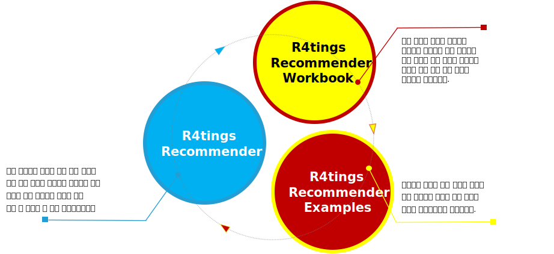

<!--
<div align="right">
  <b>English</b> | <a href="/README_KO.md">한국어</a> |  <a href="/README_JA.md">日本語</a>
</div>
-->
<br/>


## 소개(Introduction)

추천 시스템은 많은 양의 정보 안에서 사용자가 적합한 정보를 선택할 수 있도록 도와주는 시스템으로, GroupLens Research의 [LensKit](https://lenskit.org/), 아파치 소프트웨어 재단의 [Apache Mahout](https://mahout.apache.org/)과 [Apache PredictionIO](https://predictionio.apache.org/) 등, 다양한 형태의 추천 컴포넌트나 시스템들이 오픈소스로도 제공되고 있으나, 추천 모델이 기본 수식만 구현되어 있거나, 블랙박스(black-box)로 제공되는 등 학술 연구나 상용화 목적의 개념 증명(PoC, Proof of Concept)을 위한 프로토타입 설계 및 구현 단계에서, 적용 영역에 따라 수식과 데이터의 내부 흐름을 미세 조정하고 유연하게 대응하기가 쉽지 않습니다. 또한, 웹 기반의 Notebook을 제공하는 Apache Zeppelin이나 Jupyter Notebook, 또는 Rmarkdown으로 추천 시스템을 구현해볼 수 있으나, 이는 분석가의 업무 흐름에 따라 하나의 Notebook에서 데이터와 처리를 표현하게 하는 목적으로 실제로 독립 시스템으로 구현하기에는 고려할 사항이 적지 않습니다.

이러한 다양한 오픈 소스 추천 시스템들은 다양한 목적에 맞게 사용할 수 있지만, 실제 적용 영역에서 발생할 수 있는 모델 제한성, 블랙박스 모델, 확장성과 대용량 데이터 처리 측면에서 일부 단점이 존재할 수 있습니다.

- 대용량 데이터 처리 : 구현된 언어나 방식에 따라 대규모 데이터를 다루는 데 한계가 있을 수 있으며, 대용량 데이터셋에서는 성능 문제가 발생할 수 있습니다
- 제한된 수정 가능성 : 많은 오픈 소스 추천 시스템은 자체 모델을 기반으로 동작하며, 특정 수식의 알고리즘 구현에 초점을 맞춥니다. 이로 인해 상용화나 적용 영역에 따라 수식을 수정하거나 모델을 확장하기 어려울 수 있습니다.
- 블랙박스 모델의 제한 : 몇몇 추천 시스템은 모델 내부 동작을 블랙박스로 다루며, 사용자가 모델 동작을 이해하고 수정 및 확장을 어렵게 만듭니다.

R4tings Recommender 프로젝트는 오픈 소스 추천 엔진을 개발하고, 커뮤니티에 의해 유지 및 발전될 수 있는 오픈소스 에코 시스템 구축을 목적으로 합니다.

- 오픈 소스 추천 엔진 패키지
  - 추천 시스템을 위한 대규모 데이터의 병렬 처리가 가능
  - 추천 처리 과정을 단계별로 분해하여 내부 흐름을 쉽게 이해 할 수 있도록 컴포넌트로 제공
  - 추천모델을 보다 유연하게 확장 할 수 있도록, 내부 알고리즘은 고차 함수로 제공
- 오픈소스 에코 시스템
  - 추천 시스템에 대한 학습과 이해를 돕기 위한 워크북 제공
  - 다양한 배경과 관심을 가진 사용자들이 참여하여 추천 시스템에 대한 새로운 아이디어를 시험
  - 새로운 아이디어의 시험 결과인 추천 기법이나 수정되거나 확장된 기능을 플러그인(Plugin) 형식으로 프로젝트에 공유

이 프로젝트의 목표는 다음과 같습니다.

- 전통적인 통계나 기계 학습 기반 추천 모델들의 구현체와 워크샵 제공을 통한 추천 시스템의 학습과 이해
- 시뮬레이터나 프로토타이핑을 통한 학술 연구 목적에서의 이론 및 성능 검증
- 상용 수준의 추천 시스템 구현 가능성 검토



R4tings Recommender 오픈 소스 추천 엔진은  추천 시스템을 구현하기 위한 Java와 Apache Spark 기반의 핵심코드와 이를 활용하기 위한 예제 코드가 포함된 워크북을 함께 제공합니다.

- <a href="https://github.com/r4tings/r4tings-recommender/tree/main/recommender" target="_blank">**핵심 코드**</a> : 전통적인 통계나 기계 학습 기반의 추천 기법들과 절차를 구현한 핵심 코드는 오픈 소스로 제공되며, 누구나 프로젝트의 소스 코드를 자유롭게 확장하고 개선할 수 있습니다.
- <a href="http://r4tings.com/docs/recommender/latest/workbook/home" target="_blank">**워크북**</a>과 <a href="https://github.com/r4tings/r4tings-recommender/tree/main/recommender-examples" target="_blank">**예제 코드**</a> : 추천 시스템을 학습하고 이해하는 데 도움이 되며, 프로토타입을 개발하거나 새로운 기법을 시험하기 위한 기초를 제공합니다. 또한 상용 수준의 추천 시스템을 구현하려는 경우의 출발점으로 사용할 수 있으며 커뮤니티의 참여와 기여를 유도합니다.

<!--

이러한 이유로 “R4tings Recommender 오픈소스 추천엔진”은 추천을 위한 통계나 기계 학습 기법들은 수정 없이 재사용 가능한 고차 함수로 제공하고, 수정되거나 새로운 기법을 적용하여 만들어진 고차 함수는 기존 고차 함수와 조합하거나, 컴포넌트로 제공되는 파이프라인을 통하여 다양한 도메인에 적용할 수 있도록, 추천하는 과정들을 단계별로 분해하여 하나의 파이프라인으로 연결하여 병렬 처리 할 수 있게 하는 것을 목표로 합니다.  


“R4tings Recommender 오픈소스 추천엔진”은 전통적인 통계나 기계 학습 기반의 추천 모델들의 기본 구현체인 “[R4tings Recommender](https://github.com/r4tings/recommender/tree/main/recommender)”와 실행 예제들인 “[R4tings Recommender Examples](https://github.com/r4tings/recommender/tree/main/recommender-examples)"의 두 개의 프로젝트를 포함하고 있어 추천 처리 과정을 단계별로 분해하여 내부 흐름을 쉽게 이해하고, 추천을 위한 통계나 기계 학습 기법들을 손쉽게 수정하거나 확장 또는 재사용할 수 있습니다.

“**R4tings Recommender 오픈소스 추천엔진**”의 최종 목표는 1) 전통적인 통계나 기계 학습 기반 추천 모델들의 구현체 제공을 통한 추천 시스템의 학습과 이해, 2) 시뮬레이터나 프로토타이핑을 통한 학술 연구 목적에서의 이론 검증, 3) 상용 수준의 추천 시스템 구현을 용이하게 하는 것입니다.
-->

## 구현 요소(Components)

R4tings Recommender는 추천 시스템에 필요한 평점 점규화와 유사도 계산, 그리고 평점 예측과 아이템 추천에 대한 구현체를 제공합니다.

### 지원 알고리즘 및 클래스

- **평점 정규화** 
  - 평균 중심화 ([MeanCenteringNormalizer](./recommender/src/main/java/com/r4tings/recommender/data/normalize/MeanCenteringNormalizer.java) 클래스)
  - Z점수화 ([ZScoreNormalizer](./recommender/src/main/java/com/r4tings/recommender/data/normalize/ZScoreNormalizer.java) 클래스)
  - 최소-최대화 ([MinMaxNormalizer](./recommender/src/main/java/com/r4tings/recommender/data/normalize/MinMaxNormalizer.java) 클래스)
  - 소수 자릿수화 ([DecimalScalingNormalizer](./recommender/src/main/java/com/r4tings/recommender/data/normalize/DecimalScalingNormalizer.java) 클래스)
  - 이진 임계화 ([ThresholdBinarizer](./recommender/src/main/java/com/r4tings/recommender/data/normalize/ThresholdBinarizer.java) 클래스)
- **유사도 계산**
  - 코사인 유사도 ([CosineSimilarityMeasurer](./recommender/src/main/java/com/r4tings/recommender/model/measures/similarity/CosineSimilarityMeasurer.java) 클래스)
  - 피어슨 상관계수와 유사도 ([PearsonSimilarityMeasurer](./recommender/src/main/java/com/r4tings/recommender/model/measures/similarity/PearsonSimilarityMeasurer.java) 클래스)
  - 유클리드 거리와 유사도 ([EuclideanSimilarityMeasurer](./recommender/src/main/java/com/r4tings/recommender/model/measures/similarity/EuclideanSimilarityMeasurer.java) 클래스)
  - 이진 속성과 유사도 ([ExtendedJaccardSimilarityMeasurer](./recommender/src/main/java/com/r4tings/recommender/model/measures/similarity/ExtendedJaccardSimilarityMeasurer.java) 클래스)
- **평점 예측과 아이템 추천**
  - 이웃 기반 협업 필터링 추천 ([KNearestNeighbors](./recommender/src/main/java/com/r4tings/recommender/model/knn/KNearestNeighbors.java) 클래스와 [KNearestNeighborsParams](./recommender/src/main/java/com/r4tings/recommender/model/knn/KNearestNeighborsParams.java) 클래스)
  - 특잇값 분해 기반 협업 필터링 추천 ([BaselineSingleValueDecomposition](./recommender/src/main/java/com/r4tings/recommender/model/svd/BaselineSingleValueDecomposition.java) 클래스와 [BaselineSingleValueDecompositionParams](./recommender/src/main/java/com/r4tings/recommender/model/svd/BaselineSingleValueDecompositionParams.java) 클래스)
  - TF-IDF 콘텐츠 기반 필터링 추천 ([TermFrequencyInverseDocumentFrequency](./recommender/src/main/java/com/r4tings/recommender/model/tfidf/TermFrequencyInverseDocumentFrequency.java) 클래스와 [TermFrequencyInverseDocumentFrequencyParams](./recommender/src/main/java/com/r4tings/recommender/model/tfidf/TermFrequencyInverseDocumentFrequencyParams.java) 클래스)
  - 연관규칙 기반 추천 ([AssociationRuleMining](./recommender/src/main/java/com/r4tings/recommender/model/arm/AssociationRuleMining.java) 클래스와 [AssociationRuleMiningParams](./recommender/src/main/java/com/r4tings/recommender/model/arm/AssociationRuleMiningParams.java) 클래스)

### 평점 정규화

정규화는 데이터 집합에서 다른 범위나 척도를 가진 값을 일정한 범위로 변환하는 과정입니다.
평점 데이터의 경우, 평점이 서로 다른 척도 또는 범위를 가지기 때문에 평점 정규화를 통해 사용자마다 서로 다른 평점 기준과 아이템에 대한 선호에 따른 평점의 차이를 조정합니다.

- 평균 중심화 (전체/사용자/아이템)
- Z점수화 (전체/사용자/아이템)
- 최소-최대화 (전체/사용자/아이템)
- 소수 자릿수화 (전체)
- 이진 임계화 (전체)

<video class="w-100" controls><source src="https://github.com/r4tings/r4tings-recommender/assets/123946859/ceab3963-c27e-4617-a3b3-d9a0dcd71891" type="video/mp4" /></video>

### 유사도 계산

유사도 계산은 다차원 공간에서 데이터 포인트 간의 유사성을 측정하는 방법입니다.
사용자가 아이템에 매긴 평점 데이터를 기반으로 사용자나 아이템 간의 유사성 또는 거리를 측정하여 데이터 간의 관련성을 파악하는 데 사용됩니다.

- 코사인 유사도 (사용자/아이템)
- 피어슨 상관계수와 유사도 (사용자/아이템)
- 유클리드 거리와 유사도 (사용자/아이템)
- 이진 속성과 유사도 (사용자/아이템)

<video class="w-100" controls><source src="https://github.com/r4tings/r4tings-recommender/assets/123946859/03a122d3-c094-44d7-8b6d-4fb7280ae616" /></video>

### 평점 예측과 아이템 추천

- 이웃 기반 협업 필터링 추천
- 특잇값 분해 기반 협업 필터링 추천
- TF-IDF 콘텐츠 기반 필터링 추천
- 연관규칙 기반 추천

<video class="w-100" controls><source src="https://github.com/r4tings/r4tings-recommender/assets/123946859/71763280-ad25-4517-b2e6-3f0fc4008e18" type="video/mp4" /></video>

#### 이웃 기반 협업 필터링 추천

전통적인 협업 필터링 알고리즘 중 하나인 k-최근접 이웃을 사용하는 메모리 기반 협업 필터링 추천 모델입니다.
사용자 간 또는 아이템 간의 유사성을 기반으로 아이템을 추천합니다.

#### 특잇값 분해 기반 협업 필터링 추천

행렬 분해 알고리즘 중 하나인 특잇값 분해 접근 방법을 사용하는 모델 기반 협업 필터링 추천 모델입니다.
평점 데이터의 기준선 추정을 통한 잔차의 절단된 특잇값 분해를 기반으로 아이템을 추천합니다.

#### TF-IDF 콘텐츠 기반 필터링 추천

콘텐츠 기반 필터링 추천은 사용자가 선호하는 아이템의 특징, 즉 콘텐츠가 유사한 아이템을 추천하는 메모리 기반 추천 모델입니다.
아이템의 TF-IDF 벡터를 구하고, 사용자의 TF-IDF 벡터 간의 코사인 유사도를 계산하여 아이템을 추천합니다.

#### 연관규칙 기반 추천

연관규칙 추천은 어떤 아이템과 동반하여 등장하는 아이템에 대한 규칙인 아이템 간의 연관성을 분석하여 아이템을 추천하는 메모리 기반 추천 모델입니다.
흥미도 측도인 연관규칙의 지지도와 신뢰도를 계산하여 아이템을 추천합니다.

## Get Started

### 필수 및 선택 소프트웨어(Required and optional software)

#### 필수(Required)

|소프트웨어|버전|설명|
|------|---|---|
|JDK|8 또는 11| <p>OpenJDK 또는 Oracle JDK <p>* OpenJDK를 내려받고 구성하는 방법은 [링크](https://docs.oracle.com/en/java/javase/11/) 를 참고하세요 <p>* Oracle JDK를 내려받고 구성하는 방법은 [링크](https://docs.oracle.com/en/java/javase/11/)를 참고하세요|

#### 선택(Optional)

|소프트웨어|버전|설명|
|------|---|---|
|Git|Latest| Git을 내려받고 구성하는 방법은 [링크](https://git-scm.com/downloads)를 참고하세요|
|Git Client|Latest| <p>GitHub Desktop 또는 Sourcetree <p>* GitHub Desktop을 내려받고 구성하는 방법은 [링크](https://docs.github.com/en/desktop/) 를 참고하세요 <p>* Sourcetree를 내려받고 구성하는 방법은 [링크](https://www.sourcetreeapp.com/)를 참고하세요|
|Gradle|Latest|Build Tool을 내려받고 구성하는 방법은 [링크](https://docs.gradle.org/current/userguide/what_is_gradle.html/)를 참고하세요|
|IntelliJ|Latest|IntelliJ를 내려받고 구성하는 방법은 [링크](https://www.jetbrains.com/idea/)를 참고하세요|
|R|Latest|R을 내려받고 구성하는 방법은 [링크](https://www.r-project.org/)를 참고하세요|
|RStudio Desktop|Latest|RStudio Desktop을 내려받고 구성하는 방법은 [링크](https://posit.co/products/open-source/rstudio/)를 참고하세요|

### 프로젝트 구성하기(Set up the project)

> **Note**
> 필수 소프트웨어인 JDK 11의 설치와 구성이 사전에 완료되었다고 가정합니다.
> 
> 프로젝트 구성하기의 설명은 MS Windows 10 기준으로 작성되었습니다.
> 
> Windows OS에서의 전체 예제 실행은 [`set-up-the-project-on-windows.ps1`](https://github.com/r4tings/r4tings-recommender/blob/main/set-up-the-project-on-windows.ps1) 를 참고하세요.
 
① Windows + R 단축키를 이용 해 실행 창을 열어 줍니다.

② powershell 이라고 타이핑 후 확인을 클릭합니다.

③ PowerShell을 실행한 뒤, 루트 경로로 이동하기 위해 "cd /"를 입력하여 실행합니다.

④ C:에 "mkdir r4tings"를 입력하여 실행하여 r4tings 폴더를 생성하고 생성된 폴더로 이동하기 위해 "cd r4tings"를 입력하여 실행합니다.

⑤ R4tings Recommender 리파지토리의 GitHub 소스 코드 보관 파일을 내려받기 위해 "Invoke-WebRequest https://github.com/r4tings/r4tings-recommender/archive/refs/heads/main.zip -OutFile r4tings-recommender-main.zip"를 입력하여 실행합니다.

⑥ 내려받은 소스 코드 보관 파일의 압축 해제를 위해 "Expand-Archive -LiteralPath r4tings-recommender-main.zip -DestinationPath ."를 입력하여 실행합니다.

⑦ 압축이 해제된 폴더의 이름을 변경하기 위해 "Rename-Item -Path r4tings-recommender-main -NewName r4tings-recommender"를 입력하여 실행합니다.

⑧ "cd r4tings-recommender"를 입력하여 프로젝트 폴더로 이동하고 "ls"를 입력하고 실행하여 r4tings-recommender-master 폴더의 내용을 확인합니다.

⑨ 마지막으로 "./gradlew clean build -x test"를 입력하여 프로젝트를 빌드합니다.

```powershell

Windows PowerShell
Copyright (C) Microsoft Corporation. All rights reserved.

새로운 크로스 플랫폼 PowerShell 사용 https://aka.ms/pscore6

PS C:\Users\r4tings> cd /
PS C:\Users\r4tings> Remove-Item -path /r4tings -recurse -confirm
PS C:\> mkdir r4tings


    디렉터리: C:\


Mode                 LastWriteTime         Length Name
----                 -------------         ------ ----
d-----      2023-10-01  오전 11:38                r4tings

PS C:\> cd r4tings
PS C:\r4tings> Invoke-WebRequest https://github.com/r4tings/r4tings-recommender/archive/refs/heads/main.zip -OutFile r4tings-recommender-main.zip
PS C:\r4tings> Expand-Archive -LiteralPath r4tings-recommender-main.zip -DestinationPath .
PS C:\r4tings> Rename-Item -Path r4tings-recommender-main -NewName r4tings-recommender
PS C:\r4tings> cd r4tings-recommender
PS C:\r4tings\r4tings-recommender> ls


    디렉터리: C:\r4tings\r4tings-recommender


Mode                 LastWriteTime         Length Name
----                 -------------         ------ ----
d-----      2023-10-01  오전 11:40                dataset
d-----      2023-10-01  오전 11:40                gradle
d-----      2023-10-01  오전 11:40                lib
d-----      2023-10-01  오전 11:40                recommender
d-----      2023-10-01  오전 11:40                recommender-examples
-a----      2023-10-01   오후 6:58            151 .gitignore
-a----      2023-10-01   오후 6:58            275 .whitesource
-a----      2023-10-01   오후 6:58           3857 build.gradle
-a----      2023-10-01   오후 6:58            209 gradle.properties
-a----      2023-10-01   오후 6:58           8639 gradlew
-a----      2023-10-01   오후 6:58           2776 gradlew.bat
-a----      2023-10-01   오후 6:58          14480 README.md
-a----      2023-10-01   오후 6:58             87 settings.gradle

PS C:\r4tings\r4tings-recommender> ./gradlew clean build -x test
⋯ - 일부 생략 -
PS C:\r4tings\r4tings-recommender>
```


https://github.com/r4tings/r4tings-recommender/assets/123946859/6639a38a-e20d-45b0-ad7a-047bff745f8e


**R4tings Recommender 오픈소스 추천엔진**의 디렉토리 구조는 다음과 같습니다

```
C:\r4tings
   ├── r4tings-recommender-main.zip                <- R4tings Recommender 소스 코드 보관 파일
   └── r4tings-recommender
       ├── dataset                                 <- 예제 데이터셋 
       │   └── r4tings                             <- r4tings 데이터셋
       ├── gradle                                  
       │   └── wrapper                             <- Gradle Wrapper
       ├── lib                                     
       │   └── hadoop-2.8.3                        <- Microsoft Windows용 Hadoop 바이너리
       ├── recommender                             <- R4tings Recommender 프로젝트
       │   └── src
       ├── recommender-examples                    <- R4tings Recommender Examples 프로젝트 
       │   └── src
       ├── ⋯                                       <- 일부 생략  
       ├── build.gradle                            <- Gradle 빌드 파일
       ├── gradle.properties                       <- Gradle 속성 파일
       ├── gradlew                                 <- Gradle 맥/리눅스용 스크립트 파일
       ├── gradlew.bat                             <- Gradle 윈도우용 스크립트 파일
       └── settings.gradle                         <- Gradle 설정 파일
```

> **Warning**
> 
> 프로젝트 폴더 명에는 **-main**이 없습니다.
> 
> 프로젝트 폴더는 r4tings-recommender 입니다.
> 
> Microsoft Windows용 Hadoop 바이너리는 [링크](https://github.com/cdarlint/winutils/)를 참고하세요.
> 
> 리포지토리 뷰에서 소스 코드 보관 파일 다운로드하는 자세한 내용은 [링크](https://docs.github.com/ko/repositories/working-with-files/using-files/downloading-source-code-archives#downloading-source-code-archives-from-the-repository-view)를 참고하세요.

### 데이터셋 준비하기(Prepare Dataset)

- R4tings Recommender 프로젝트의 데이터셋 준비하기는 [링크](https://github.com/r4tings/r4tings-recommender/blob/main/recommender/README.md#데이터셋-준비하기prepare-dataset) 를 참고하세요.
- R4tings Recommender Examples 프로젝트의 데이터셋 준비하기는 [링크](https://github.com/r4tings/r4tings-recommender/blob/main/recommender-examples/README.md#데이터셋-준비하기prepare-dataset) 를 참고하세요.

## 유용한 정보(Other Resources)

### 기술 스택(Technology Stack)

- 프로그래밍 언어 : Java 100% (JDK 8 / 11 호환)
- 개발 환경
    - 소프트웨어 형상 관리: Git / GitHub
    - 빌드 도구 : Gradle 8.3
    - IDE:  IntelliJ IDEA Community Edition
- 라이브러리 및 프레임워크
    - Apache Spark 3.5.0 (Scala 2.12)
    - Junit
    - Logback
    - Project Lombok
    - Zip4j
- 소프트웨어 형상 관리: Git / GitHub
- 데이터셋
    - 예제(r4tings) 데이터셋 – 평점 30개
    - 북크로싱(Book-Crossing) 데이터셋 – 평점 1,149,780개
    - 무비렌즈(MovieLens) 데이터셋 – 평점 27,753,444개

### 리소스(Resources)

- <a href="http://r4tings.com" target="_blank">공식 웹사이트(Official Website)</a>
  - <a href="http://r4tings.com/docs/recommender/latest/workbook/home" target="_blank">워크북</a>
    - <a href="http://r4tings.com/docs/recommender/latest/workbook/ch-01" target="_blank">1. 추천과 추천 기법</a>
    - <a href="http://r4tings.com/docs/recommender/latest/workbook/ch-02" target="_blank">2. 데이터셋 살펴보기</a>
    - <a href="http://r4tings.com/docs/recommender/latest/workbook/ch-03" target="_blank">3. 평점 정규화</a>
    - <a href="http://r4tings.com/docs/recommender/latest/workbook/ch-04" target="_blank">4. 유사도</a>
    - <a href="http://r4tings.com/docs/recommender/latest/workbook/ch-05" target="_blank">5. 이웃 기반 협업 필터링 추천</a>
    - <a href="http://r4tings.com/docs/recommender/latest/workbook/ch-06" target="_blank">6. 특잇값 분해 기반 협업 필터링 추천</a>
    - <a href="http://r4tings.com/docs/recommender/latest/workbook/ch-07" target="_blank">7. TF-IDF 콘텐츠 기반 필터링 추천</a>
    - <a href="http://r4tings.com/docs/recommender/latest/workbook/ch-08" target="_blank">8. 연관규칙 기반 추천</a>
- <a href="https://github.com/r4tings/r4tings-recommender" target="_blank">소스 코드 저장소(GitHub)</a>
  - <a href="https://github.com/r4tings/r4tings-recommender/blob/main/recommender" target="_blank">핵심 코드</a>
  - <a href="https://github.com/r4tings/r4tings-recommender/blob/main/recommender-examples" target="_blank">예제 코드</a>
- API 문서(API Docs)
  - <a href="https://raw.githack.com/r4tings/r4tings-recommender/main/docs/javadoc/index.html" target="_blank">Java</a>
  - <a href="https://raw.githack.com/r4tings/r4tings-recommender/main/docs/testFixturesjavadoc/index.html" target="_blank">Test Fixture</a>

### 피드백과 기여(Feedback and Contributions)

- 기능 오류나 개선 사항이 있는 경우에는 [ISSUES](https://github.com/r4tings/r4tings-recommender/issues/)에 등록하거나 [DISCUSSIONS](https://github.com/r4tings/r4tings-recommender/discussions/)을 통하여 피드백 해 주세요.
- 프로젝트의 참여나 기여도 언제나 환영합니다. 자세한 정보는 [CONTRIBUTORS](CONTRIBUTORS.md)에서 확인할 수 있습니다.

### 라이선스(License)

This project is dual-licensed under [Apache License 2.0][apache] and [Creative Commons BY-NC-SA 4.0][cc-by-nc-sa]. Copyright (c) 2023 r4tings.com 

See [`LICENSE.md`](/LICENSE.md) file for details.

[apache]: https://www.apache.org/licenses/LICENSE-2.0
[cc-by-nc-sa]: https://creativecommons.org/licenses/by-nc-sa/4.0/

### 참조(References)

- <a href="https://link.springer.com/book/10.1007/978-0-387-85820-3" target="_blank">Recommender systems handbook</a>. Francesco Ricci, Lior Rokach, Bracha Shapira, Paul B. Kantor. (2011).
- <a href="https://link.springer.com/book/10.1007/978-3-319-29659-3" target="_blank">Recommender Systems  - The Textbook</a>. Charu C. Aggarwal. (2016).
- <a href="https://doi.org/10.48550/arXiv.2205.12371" target="_blank">recommenderlab: An R framework for developing and testing recommendation algorithms</a>. Michael Hahsler. (2022).
- <a href="https://www.coursera.org/specializations/recommender-systems" target="_blank">Recommender Systems Specialization</a>. Coursera.
- <a href="https://spark.apache.org" target="_blank">Apache Spark</a>. The Apache Software Foundation.

### 연락처(Contact)

프로젝트에 대한 질문이나 제안, 또는 기타 연락이 필요한 경우, [dongsup.kim\@r4tings.com](mailto:dongsup.kim@r4tings.com?subject=[r4tings.com]) 으로 연락 주세요.

## 뉴스 및 업데이트(News & Updates):

> [2023-12-01] 제17회 공개SW 개발자대회 은상(한국정보과학회 회장상). 과학기술정보통신부 (2023)
>
> <sup>R4tings Recommender - Java 언어와 Apache Spark 라이브러리 기반으로 구현된 오픈 소스 추천 엔진</sup>

<br/>

<div align="right">
   <a rel="license" href="http://creativecommons.org/licenses/by-nc-sa/4.0/"></a>
</div>
